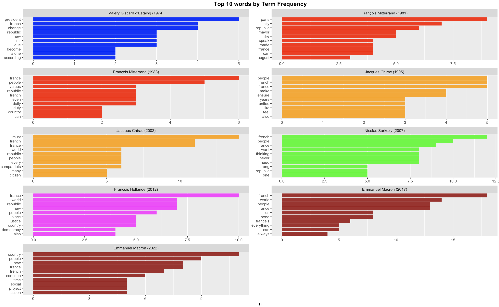
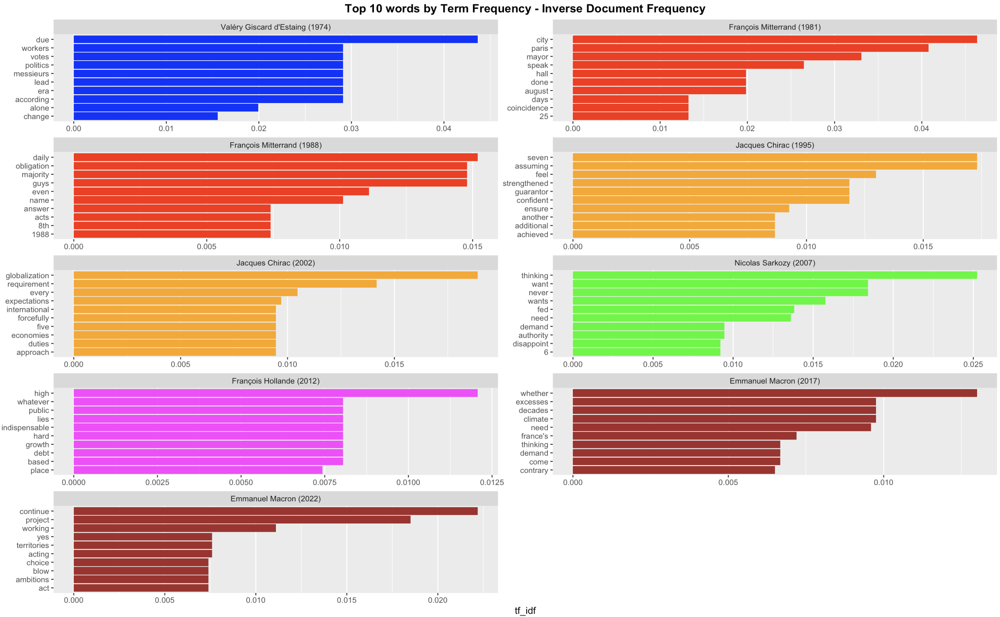
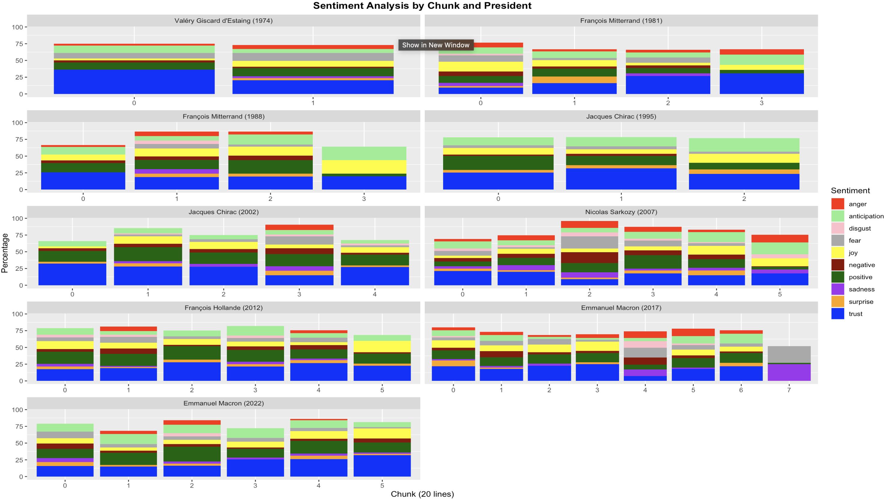

<br />

I chose to carry out this final project on French politics. To do so, I collected from an official government website the inaugural speeches of every French president of the Fifth Republic.
The aim of this study is to see how their speeches have evolved, in keeping with the history of France.

<br />

Link to github repository : https://github.com/kounen/FrenchPresidentsInvestitureSpeech

Link to RPubs : https://rpubs.com/lucghd/frenchpresidentsanalysis

<br />

```{r include=FALSE}
knitr::opts_chunk$set(warning = FALSE, message = FALSE) # To avoid warning in HTML page
```

# Install the necessary packages
```{r}
# Uncomment to install
# install.packages("dplyr")
# install.packages("tidytext")
# install.packages("stopwords")
# install.packages("SnowballC")
# install.packages("ggraph")
# install.packages("tidyr")
# install.packages("tidygraph")
# install.packages("widyr")
```

# Load the necessary packages
```{r}
library(dplyr) # pipe operator
library(tidytext) # unnest_tokens
library(stopwords) # to remove french and english stop words
library(SnowballC) # for stemming
library(ggraph) # for visual graph construction
library(tidyr) # for pivot_wider() function
library(tidygraph) # for data graph construction
library(widyr) # for pairwise_cor()
```

# Load the dataset
I had to recreate a csv myself from the speeches I found. For each, I specified the date of inauguration, the president concerned and the link to the original source.
Bear in mind that the original text is French, so I had to translate it. It's important to bear in mind that, since a translation is an interpretation, the results cannot be considered 100% accurate.
```{r}
speeches_data <- read.csv('data/Speeches.csv', sep=';') 
speeches_data
```

<br />

# Compare speeches' length
Before going on to any pre-processing, I wanted to compare the length of each.
We can clearly see that the length of speeches has only increased since the beginning of the Fifth Republic. But why? Is it because, back then, presidents didn't feel the need to spread out their future mandate, or is it just that today, even when elected, an inaugural speech is so important for the president, and so politicizable, that he or she must take care to announce, thank...
```{r}
# Add a column containing for each speech, its length
speeches_length <- speeches_data %>%
  mutate(Length = nchar(Speech))

# Historical order
speeches_length$President <- factor(speeches_length$President,
                          levels = c("Valéry Giscard d'Estaing (1974)", "François Mitterrand (1981)",	"François Mitterrand (1988)", "Jacques Chirac (1995)", "Jacques Chirac (2002)", "Nicolas Sarkozy (2007)", "François Hollande (2012)", "Emmanuel Macron (2017)", "Emmanuel Macron (2022)"))

# Create a speech length bar graph to compare them
ggplot(speeches_length, aes(x = President, y = Length)) +
  geom_bar(stat = "identity", fill = "blue") +
  labs(x = "President", y = "Speech Length") +
  ggtitle("Inauguration Speech Length Comparison") +
  theme(plot.title = element_text(face = "bold", hjust = 0.5), # Bold title, centered
        panel.grid.major.x = element_blank(), # Remove x-axis grid lines
        axis.text.x = element_text(angle = 45, hjust = 1)) # Rotate x-axis labels for better readability
```

<br />

# Tokenize the text into words, remove stop words (french and english) and stem the surviving ones
Here, we're going to remove both the English and French "stop" words in case there are any left.
If you wish, you can also uncomment the 'stemming' line to obtain an analysis that is not subject to disturbances such as singular/plural, infinitive/conjugated verb...
```{r}
english_stopwords <- stopwords("en")
french_stopwords <- stopwords("fr")

speeches_tidy <- speeches_data %>%
  # Group by President
  group_by(President) %>%
  # Tokenize
  unnest_tokens(output = word, input = Speech) %>%
  # Added line number for future analysis (one line contains 10 words)
  mutate(line_number = ceiling(row_number() / 10)) %>%
  # Remove stop words
  anti_join(data.frame(word = english_stopwords), by = "word") %>%
  anti_join(data.frame(word = french_stopwords), by = "word") # Uncoment if you want stemming %>%
  # Apply stemming
  # Uncoment if you want stemming mutate(word = wordStem(word, language = "en"))
speeches_tidy
```

<br />

# Analysis - TF (Term Frequency)
The terms used to designate France and the French are numerous. But also the internationalization of the discourse. In Mr. Mitterant's case, the words Paris and city at the top of the list demonstrate a more accessible vision on a national scale. In contrast, the word "world" in the speeches of Presidents Chirac, Hollande and Macron, which date from 2002 (development of Europe...) underlines the internationalization policy that France intends to pursue.
```{r}
# Extract the top 10 words in terms of frequency from each president's speeches
top10tf <- speeches_tidy %>%
  count(President, word) %>%
  group_by(President) %>%
  slice_max(n, n = 10, with_ties = F) # False to avoid multiple elements with the same value

# Historical order
top10tf$President <- factor(top10tf$President,
                          levels = c("Valéry Giscard d'Estaing (1974)", "François Mitterrand (1981)",	"François Mitterrand (1988)", "Jacques Chirac (1995)", "Jacques Chirac (2002)", "Nicolas Sarkozy (2007)", "François Hollande (2012)", "Emmanuel Macron (2017)", "Emmanuel Macron (2022)"))

# Define my color palette
my_colors <- c("blue", "red", "red", "orange", "orange", "green", "magenta", "brown", "brown")

# Create the top 10 tf bar graph
ggplot(top10tf, aes(x = reorder_within(word, n, President), # To order by word frequency
                  y = n,
                  fill = President)) +
  geom_col(show.legend = F) + # To remove President legend
  coord_flip() + # To flip axis
  facet_wrap(~President, scales = "free", ncol = 2) + # To remove unused top10 words + space on x axis
  scale_x_reordered() + # To remove x axis legends
  scale_fill_manual(values = my_colors) + # To use my defined colors
  labs(x = NULL) + # To remove reorder labels
  ggtitle("Top 10 words by Term Frequency") +
  theme(plot.title = element_text(face = "bold", hjust = 0.5), # Bold title, centered
        panel.grid.major.y = element_blank()) # Remove y-axis grid lines
  
```
<center>

</center>
As you can see above, the image appears a second time because the automatic rendering from Knit creates some displaying issues. So I prefer to put it again to be sure that you will be able to consult it.

Also, as you can, I choose a similar color when the speech corresponds to the same President for a better understanding.
This remarks can be apply for the next graph.

<br />

# Analysis - TF-IDF (Term Frequency - Inverse Document Frequency)
Formula used to compute tf-idf.
$${\large\text{TF-IDF} = TF{\times}\log\frac{{\text{N}}}{{\text{DF}}}}$$
The TF-IDF graph shows us more different words from one speech to another.

Indeed, the presence of terms concerning climate is quite heterogeneous. Absent from the speeches until 2017, this mention is consistent with the social struggles over the environment that have been waged over the last 10 years in Europe and France (Greta Thunberg).

The first speech calls for a new 'era', while subsequent speeches tend to praise their predecessors with 'decades', 'achieved', 'done'... What's more, almost all of them focus on the work that now lies ahead in their new mandate: 'need', 'demand', 'growth'...

François Hollande's speech highlights the economic crisis of the late 2010s. The terms 'whatever', 'indispensable', 'hard', 'growth' and 'debt' underline this.
```{r}
# - An indicator of the degree to which a word is uncommon but frequently used in a specific text
# - Used to find key words that reveal the personality of a text

# Extract the top 10 words in terms of tf-idf from each president's speeches
top10tfidf <- speeches_tidy %>%
  count(President, word) %>%
  # Combine the term frequency (TF) and inverse document frequency (IDF) calculations into a single step
  bind_tf_idf(term = word,           # Word
              document = President,  # Text delimiter
              n = n) %>%             # Word frequency
  group_by(President) %>%
  slice_max(tf_idf, n = 10, with_ties = F) # False to avoid multiple elements with the same value

# Historical order
top10tfidf$President <- factor(top10tfidf$President,
                          levels = c("Valéry Giscard d'Estaing (1974)", "François Mitterrand (1981)",	"François Mitterrand (1988)", "Jacques Chirac (1995)", "Jacques Chirac (2002)", "Nicolas Sarkozy (2007)", "François Hollande (2012)", "Emmanuel Macron (2017)", "Emmanuel Macron (2022)"))

# Create the top 10 tf-idf bar graph
ggplot(top10tfidf, aes(x = reorder_within(word, tf_idf, President), # To order by tf-idf
                  y = tf_idf,
                  fill = President)) +
  geom_col(show.legend = F) + # To remove President legend
  coord_flip() + # To flip axis
  facet_wrap(~President, scales = "free", ncol = 2) + # To remove unused top10 words + space on x axis
  scale_x_reordered() + # To remove x axis legends
  scale_fill_manual(values = my_colors) + # To use my previous defined colors
  labs(x = NULL) + # To remove reorder labels
  ggtitle("Top 10 words by Term Frequency - Inverse Document Frequency") +
  theme(plot.title = element_text(face = "bold", hjust = 0.5), # Bold title, centered
        panel.grid.major.y = element_blank()) # Remove y-axis grid lines
```
<center>

</center>

<br />

# Sentimental Analysis using 'bing' lexicon
Goal: Compare for each speech the distribution of positive and negative words.

Then, to compare only the positive and negative aspects, let's use "bing", which is the most inclusive lexicon for this.

As you can see below, there's a good balance between positive and negative words in each speech. Around 75% positive and 25% negative. It's a good ratio, given that an inaugural speech should motivate (positive), but also remind us of the challenges to be overcome in the coming years (negative?).

```{r}
speeches_posneg <- speeches_tidy %>%
  inner_join(get_sentiments("bing")) %>% # Use 'bing' lexicon
  count(President, sentiment) %>%
  group_by(President) %>%
  mutate(percentage = n / sum(n) * 100) %>% # Compute distribution in %
  rename(Sentiment = sentiment) # Rename sentiment column for aesthetics reason (legend displaying)

# Historical order
speeches_posneg$President <- factor(speeches_posneg$President,
                          levels = c("Valéry Giscard d'Estaing (1974)", "François Mitterrand (1981)",	"François Mitterrand (1988)", "Jacques Chirac (1995)", "Jacques Chirac (2002)", "Nicolas Sarkozy (2007)", "François Hollande (2012)", "Emmanuel Macron (2017)", "Emmanuel Macron (2022)"))

# Create the circular graphs
ggplot(speeches_posneg, aes(x = "", y = percentage, fill = Sentiment)) +
  geom_bar(stat = "identity", width = 1, color = "white") +
  geom_text(aes(
    label = paste0(round(percentage), "%")), # Display percentage values on each graph
    position = position_stack(vjust = 0.5),
    color = "white",
    size = 3) +
  coord_polar("y", start = 0) +
  facet_wrap(~President, strip.position = "bottom", ncol = 3, labeller = label_wrap_gen(width = 20)) +
  scale_fill_manual(values = c("negative" = "red", "positive" = "darkgreen")) +
  theme_void() + # Hide ugly graph details
  ggtitle("Speeches positive/negative words distribution") +
  theme(
    legend.position = "right",
    plot.title = element_text(face = "bold", hjust = 0.5),
    strip.text = element_text(size = 8, face = "bold"),
    legend.margin = margin(t = 10, r = 10, b = 10, l = 50)
  )
```

<br />

# Sentimental Analysis using 'nrc' lexicon
Problem with previous analysis. We don't have enough substance to make a real sentimental analysis.
But that's not to count on the 'nrc' lexicon.
Most of the time, we use 'nrc' lexicon only for pure sentiment analysis (positive or negative).
Nonetheless, this lexicon contains also 8 emotions.
Let's use them to implement a more exhaustive analysis.
```{r}
# Define a chunk (group of lines)
chunk_size <- 20 # lines

# Get sentiment dataframe
speeches_sentiment <- speeches_tidy %>%
  inner_join(get_sentiments("nrc")) %>% # Use 'nrc' lexicon
  count(President, index = line_number %/% chunk_size, sentiment) %>% # Create chunk
  group_by(President, index) %>%
  mutate(total_words = sum(n)) %>%
  ungroup() %>%
  pivot_wider(names_from = sentiment, values_from = n, values_fill = 0) %>% # Reshape table
  mutate_at(vars(anger, anticipation, disgust, fear, joy, sadness, surprise, trust), ~ . / total_words * 100) # Calculate a percentage for each sentiment

# Historical order
speeches_sentiment$President <- factor(speeches_sentiment$President,
                          levels = c("Valéry Giscard d'Estaing (1974)", "François Mitterrand (1981)",	"François Mitterrand (1988)", "Jacques Chirac (1995)", "Jacques Chirac (2002)", "Nicolas Sarkozy (2007)", "François Hollande (2012)", "Emmanuel Macron (2017)", "Emmanuel Macron (2022)"))

# Define a custom color palette for each sentiment
sentiment_palette <- c("anger" = "red", "anticipation" = "lightgreen", "disgust" = "pink",
                       "fear" = "darkgray", "joy" = "yellow", "negative" = "darkred",
                       "positive" = "darkgreen", "sadness" = "purple", "surprise" = "orange",
                       "trust" = "blue")

# Reshape the data into long format
speeches_sentiment <- speeches_sentiment %>%
  tidyr::pivot_longer(cols = c(anger, anticipation, disgust, fear, joy, negative, positive, sadness, surprise, trust),
                      names_to = "Sentiment",
                      values_to = "Percentage")

# Create the stacked bar graph
ggplot(speeches_sentiment, aes(x = factor(index), y = Percentage, fill = Sentiment)) +
  geom_bar(stat = "identity", position = "stack") +
  facet_wrap(~President, ncol = 2, scales = "free_x") +
  labs(x = paste0("Chunk (", chunk_size, " lines)"), y = "Percentage") + # Dynamic legend
  ggtitle("Sentiment Analysis by Chunk and President") +
  theme(plot.title = element_text(face = "bold", hjust = 0.5), # Bold title, centered
        panel.grid.major.y = element_blank()) + # Remove y-axis grid lines
  scale_fill_manual(values = sentiment_palette) # Use our custom color palette
```

It's easy to see that the majority of Presidents are looking for a feeling of confidence in their audience.
What's more, the feeling of joy is clearly present. This is not surprising after months of campaigning for the presidency, but also after holding the highest office in the land.
We can also see more negative emotions such as fear, anger and disgust for the years 2007 and 2017. This is consistent with history, which saw a major economic crisis and an increase in the number of terrorist attacks in France, respectively.
<center>

</center>
As you can see, I tried to use colors corresponding to specific sentiments (red for anger/negative, orange for surprise, blue for trust...).

<br />

# Log Odds Ratio Analysis for Macron's speeches
As you know, President Macron is the actual French President but was already President before.
Let's compare his two investiture speeches to find some differences.

For this purpose, what's better than using log odds ration method.
$${\large\text{log odds ratio} = \log{\left(\frac{\left(\frac{n+1}{\text{total}+1}\right)_\text{Text A}}
                              {\left(\frac{n+1}{\text{total}+1}\right)_\text{Text B}}\right)}}$$
This analysis of President Macron's speeches is quite interesting. 

Firstly, it could be the most truthful, given the size of these speeches, which are the most important in our dataset. We can see that over these two mandates, the President has evolved his position. I'm thinking, for example, of the climate, which came last in his first term, whereas he gave it sufficient importance in his second term for our analysis to place the 'ecological' cause in fourth position.

It should also be noted that during his first term, he focused on the last few 'decades', whereas in his second speech, 5 years later, he stressed the importance of "continuity" in his "project". As well as the novelty he can always bring to France ('new').

```{r}
# Extract the top 10 words in terms of log odds ratio from Macron's speeches (2017 and 2022)
top10lor <- speeches_tidy %>%
  filter(President %in% c("Emmanuel Macron (2017)", "Emmanuel Macron (2022)")) %>%
  count(President, word) %>%
  pivot_wider(names_from = President,
              values_from = n,
              values_fill = list(n = 0)) %>%
  rename(EM2017 = `Emmanuel Macron (2017)`,
         EM2022 = `Emmanuel Macron (2022)`) %>%
  # Add `+1` to all values so that the frequency is greater than zero
  mutate(ratio_EM2017 = ((EM2017 + 1) / (sum(EM2017 + 1))), # Weight of words in EM2017 speech
         ratio_EM2022 = ((EM2022 + 1) / (sum(EM2022 + 1))), # Weight of words in EM2022 speech
         odds_ratio = ratio_EM2017 / ratio_EM2022,
         log_odds_ratio = log(odds_ratio)) %>%
  group_by(President = ifelse(log_odds_ratio > 0, "EM2017", "EM2022")) %>%
  slice_max(abs(log_odds_ratio), n = 10, with_ties = F) %>%
  select(word, log_odds_ratio, President)

# Refill president column with President's full name
top10lor$President[top10lor$President == "EM2017"] <- "Emmanuel Macron (2017)"
top10lor$President[top10lor$President == "EM2022"] <- "Emmanuel Macron (2022)"

# Historical order
top10lor$President <- factor(top10lor$President,
                             levels = c("Emmanuel Macron (2017)", "Emmanuel Macron (2022)"))

# Create the top 10 log odds ratio bar graph
ggplot(top10lor, aes(x = reorder_within(word, log_odds_ratio, President), # To order by log odds ratio
                  y = log_odds_ratio,
                  fill = President)) +
  geom_col(show.legend = F) + # To remove President legend
  coord_flip() + # To flip axis
  facet_wrap(~President, scales = "free", ncol = 2) + # To remove unused top10 words + space on x axis
  scale_x_reordered() + # To remove x axis legends
  labs(x = NULL) + # To remove reorder labels
  ggtitle("Top 10 words by Log Odds Ration for Macron's speeches") +
  theme(plot.title = element_text(face = "bold", hjust = 0.5), # Bold title, centered
        panel.grid.major.y = element_blank()) # Remove y-axis grid lines
```

- The *sign* and *magnitude* tell us which words are more important in the speech
- A positive number greater than 0 indicates greater importance in E.M. 2017's speech
- Negative numbers less than 0 have more weight in E.M. 2022's speech
- If it is close to 0, it has similar weight in both speeches
<br />
<br />

# Speeches' Clusters by analyzing consecutive word pairs with n-gram
Finally, let's try to capture a more global view of all the speeches.

We can see the names of certain presidents stand out, particularly the first ones. We can therefore assume that our most recent presidents made a point of thanking them during their speeches.

Last but not least, some of the expressions are present. Like "vive la république" (long live the republic), which closes almost every presidential speech.

The importance of 'citizen' in a republic is demonstrated by the red cluster at the bottom, which is the most important on this network.

Finally, the famous French quote 'Liberty, Equality, Fraternity' is present in this network, but without the word 'Fraternity'. Why is this? Is it because the elected candidate doesn't want to consider all citizens as brothers because they didn't all vote for him?

By making a network graph with Bigrams, we can:

  - Focus on pairs of words that occur frequently together in succession
  - Represented by highly related and simultaneously frequent words
  - Nodes are mostly connected
  - Clustering of words is less clear, but overall relationship of words can be seen
```{r}
# Creating our Bigrams data frame
bigram_speeches <- speeches_data %>%
  unnest_tokens(input = Speech,
                output = bigram,
                token = "ngrams",
                n = 2) %>%
  separate(bigram, c("word1", "word2"), sep = " ") %>%
  # Remove stop words
  filter(!word1 %in% c(english_stopwords, french_stopwords),
         !word2 %in% c(english_stopwords, french_stopwords)) %>%
  count(word1, word2, sort = T) %>%
  # Remove NA values after stop words cleaning
  na.omit()

# Creating a network graph data
graph_bigram <- bigram_speeches %>%
  # Flimsy filter (we don't have a lot of data here)
  filter(n >= 3) %>%
  as_tbl_graph(directed = F) %>%
  mutate(centrality = centrality_degree(), # Compute centrality
         group = as.factor(group_infomap())) # Compute community

# Creating our Bigrams network graph
set.seed(1234)
ggraph(graph_bigram, layout = "fr") +
  geom_edge_link(color = "gray50",       # Edge color
                 alpha = 0.5) +          # Edge contrast
  geom_node_point(aes(size = centrality, # Node size
                      color = group),    # Node color
                  show.legend = F) +     # Legend removal
  scale_size(range = c(5, 10)) +         # Range of node size
  geom_node_text(aes(label = name),
                 repel = T,
                 size = 5) +
  theme_graph() +
  ggtitle("Speeches Bigrams network graph") +
  theme(plot.title = element_text(face = "bold", hjust = 0.5)) # Bold title, centered
```

N-grams:

- Center around pairs of words that make sense when used together in succession
- When expressing the overall relationship between words  
<br />

# Speeches' Clusters with Phi Coefficient
To get a view of the more unique pairs in these speeches, let's use the Phi coefficient.

Here we see that one cluster stands out very clearly in terms of generality. The one in pink, containing everything about Paris, its mayor and the city in general. It's clear that, at the start of this new period, the Fifth Republic, Paris was France, and political attention was focused on it. Fortunately, this thinking has evolved and become globalized, as all our analyses show.

By making a network graph with Phi Coefficient, we can:

- Network around highly relevant word pairs
- Highly relevant words are represented even if they are less frequent
- Less relevant nodes are not connected
- Clusters of words are clearly visible, but it is difficult to see the overall relationship between words
```{r}
# Creating our Phi Coefficient data frame
phi_speeches <- speeches_tidy %>%
  add_count(word) %>%
  # Flimsy filter (we don't have a lot of data here)
  filter(n >= 5) %>%
  pairwise_cor(item = word, # Compute Phi Coefficient
               feature = President, 
               sort = T)

# Creating a network graph data
graph_phi <- phi_speeches %>%
  # Correlation must be equal or bigger than 0.05
  filter(correlation >= 0.05) %>%
  as_tbl_graph(directed = F) %>%
  mutate(centrality = centrality_degree(),
         group = as.factor(group_infomap()))

# Creating our Bigrams network graph
set.seed(1234)
ggraph(graph_phi, layout = "fr") +
  geom_edge_link(color = "gray50",
                 aes(edge_alpha = correlation, # Edge contrast
                     edge_width = 1),          # Edge thickness
                 show.legend = F) +            # Legend removal
  scale_edge_width(range = c(1, 2)) +          # Edge thickness removal
  geom_node_point(aes(size = centrality,
                      color = group),
                  show.legend = F) +
  scale_size(range = c(5, 10)) +
  geom_node_text(aes(label = name),
                 repel = T,
                 size = 5) +
  theme_graph() +
  ggtitle("Speeches Phi Coefficient network graph") +
  theme(plot.title = element_text(face = "bold", hjust = 0.5)) # Bold title, centered
```

Phi coefficient:

- Focus on highly related word pairs
- When you want to highlight clusters of words

# Conclusion

This analysis shows that France, as a world power, hasn't always had the political will to climb so high on the international stage. Certainly after the damage the country suffered in the aftermath of the World Wars.

In addition, the results achieved highlight a number of key factors (terrorism, economic crisis). This shows the historical importance of such events.